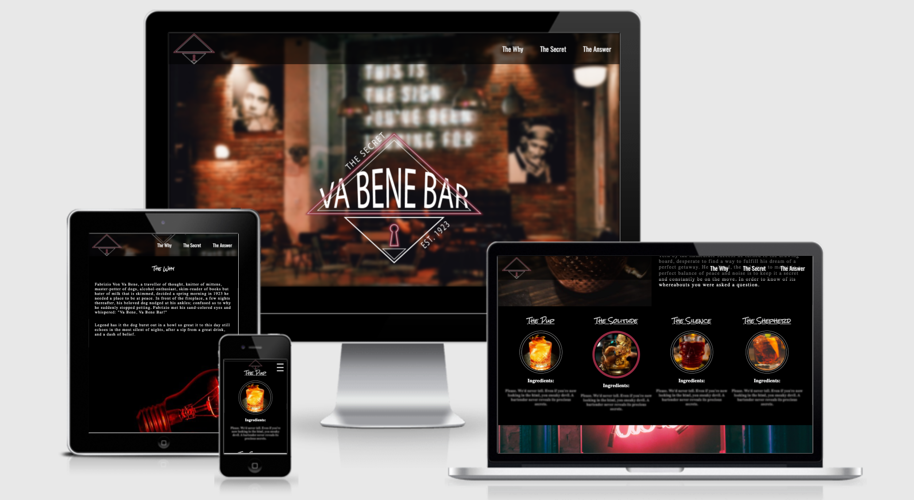
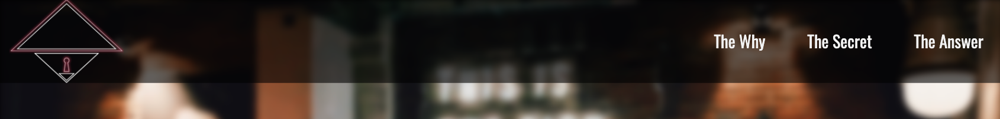
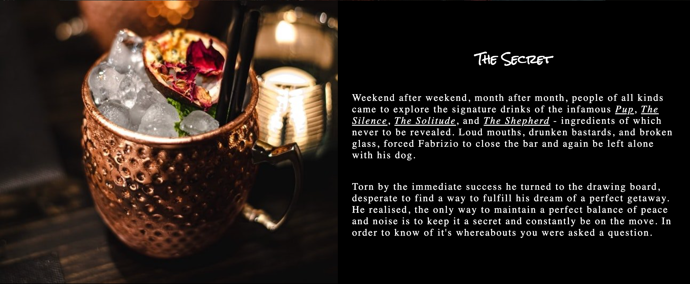
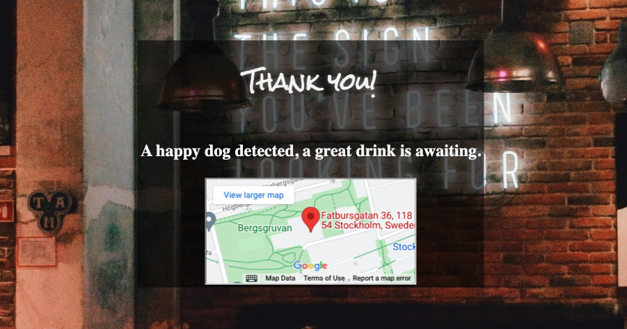
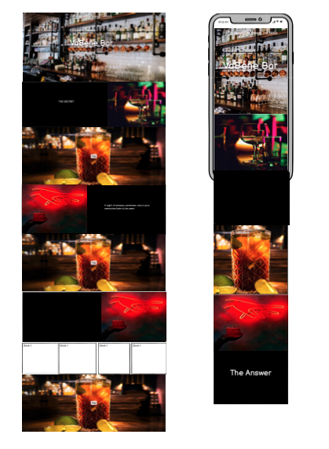
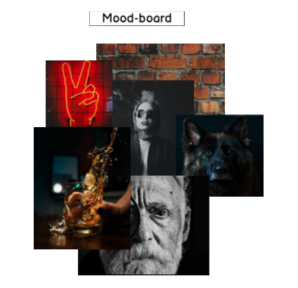
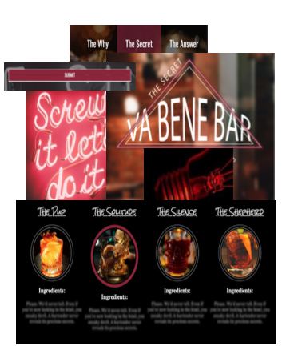
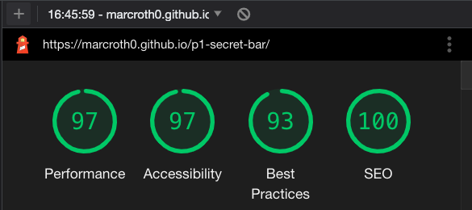
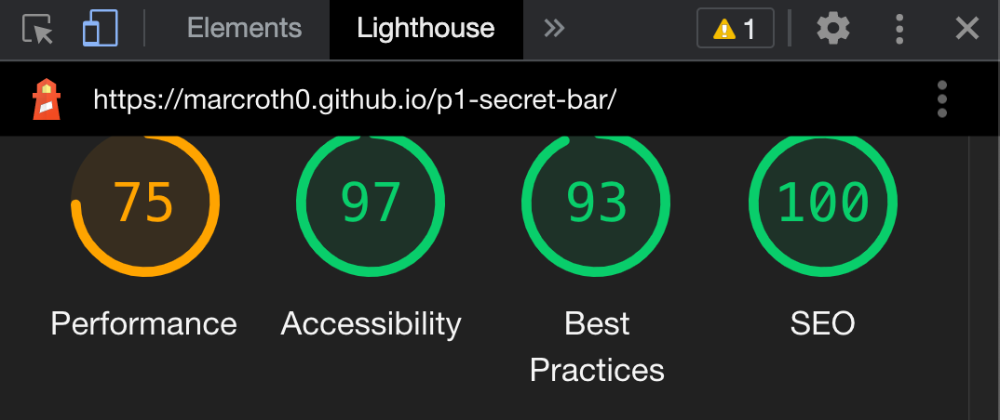
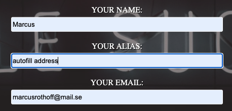

# Va Bene Bar

The Va Bene Bar is a site that will help the curious, the artistic, the seeker of tiny adventures, to find a bar suitable for them. A secret will always be an attractive aspect to an activity, because of the simple reason that it's fun to talk about it. The site hopes to do just that, attract peoples interest in being one of the few that get to visit it.



### Table of Contents

-   [Goals](#goals)
-   [Features](#features)
-   [Design](#design)
-   [Testing](#testing)
-   [Problems and Solutions](#problems-and-solutions)
-   [Credits](#credits)

# Goals

## Organisation Goals

-   Make the customer interested in the secret.
-   Have a website that fits the theme.
-   Attract the "right" customers.

## Organisation Stories

-   I want to be able to present the website in a different way compared to other bars.
-   I want simple navigation to the important parts of the page (the story)
-   I want the story to be a big part of the reason people sign up.

## User Stories

1.  As a user I want to have a clear knowing of the websites purpose.
2.  As a user I want to feel engaged in the website.
3.  As a user I want to know what drinks are offered.
4.  As a user I appreciate friendliness towards animals.
5.  As a user I want the feeling of being a selected few.
6.  As a user I want to easily navigate through the website.

## Features

### Existing Features

-   **Navigation Bar**

    -   The full responsive Navbar includes links to three parts of the page. Considering it's a one-page website they needed to be equally devided in thirds.
    -   One part defines a part of the websites story (The Why, The Secret, The Answer)
    -   (Answers User Stories 7, 1,)



-   **The landing page image**

    -   A big centered logo in front of a background that sets the mood of the rest of the website.
    -   The Parallax-effect instantly sets the need for scrolling to stay on the site.


-   **The Why section**

    -   The Why Section lets the user see the first part of the story
    -   The user will connect the lightbulb with it having something to do with an idea.
    -   (Answers User Stories 2)


-   **The Secret section**

    -   The Secret section lets user be a part of the second part of the story where charming Edward is fed up with his creation, seeking other ideas.
    -   In the story four drinks are mentioned, which are also shown underneath in a display with blurred out ingredients (to play on the secrecy)
    -   (Answers User Stories 2, 3)



-   **The Answer section**

    -   The final part of the story. Fabrizio lets the user know what is required to get the location of the secret bar.
    -   The ending image reveals the face of Fabrizio for the user. (Answers User Stories 2)


-   **The Form section**

    -   The user instantly gets informed, by the above segment, what's required in the form.
    -   A simple, but aestetic form, which follows not only the theme but also the storyline.
    -   (Answers User Stories 4,5)


-   **The Footer**

    -   The user will find what is necessary(stylisticly and required) for a Secret bar:
    -   A Social Media presence. No address, no contact information besides the form.


-   **Thank you Page**

    -   The user get sent to a hidden part of the page after submitting
    -   In the Map is the current location of the bar.
    -   (Answers User Stories)



# Design

## Planning

<p>I wireframed the website using Balsamiq to get a better idea of the layout. Not much the actual theme, but the structure. The images were merely placed there to give it life.</p>



<p>The website, being one-paged, and more visual content than informational, it needed to be aestetically pleasing to scroll down.</p>

<p>To achieve this i left the main content (The Why, The Secret, The Answer) be static and inbetween them let the backgrounds run in parallax effect. This lets the user focus on what's static, whilst taking in the vibe from the background-parallax.</p>

<p>As guidance for the theme of the website I had my moodboard with a collection of images, which colors and character built the palette with a base of black.</p>



## Details

<p>Throughout the website I added the same shade of wine-red in tiny forms. Not much, just enough to go with the theme.</p>



### Features Left to Implement

-   A way to make sure the image being sent in is in fact their own dog. As well as see
-

# Testing

<p>I tested the responsiveness of the site on the below units, using chrome dev as well as in real life testing:</p>

-   Moto G4 (360x640)
-   Galaxy S5 (360x640)
-   Pixel 2 (411x731)
-   Pixel 2 XL (411x823)
-   iPhone 5/SE (320x568)
-   iPhone 6/7/8 (375x667)
-   iPhone 6/7/8 Plus (414x736)
-   iPhone X (375x812)
-   iPad (768x1024)
-   iPad Pro (1024x1366)

**Browsers:**

-   Chrome
-   Mozilla Firefox
-   Safari
-   Edge

### Testing requirements:

**NavBar**

<p>Clicked on every link, including logo, to make sure they directed me to the correct place. </p>

**Responsiveness**

<p>Made sure nothing overflows.</p>

**Form**

-   Tested filling everything in as required and made sure it took me to the thank-you page.
-   Tested filling everyhing but required email
-   Tested filling everthing but required age

**Details**

<p>Made sure all the color-details were shown: drinks hover-effect, submit button hover-effect, and navigation hover-effect.</p>

**Fonts**

<p>Made sure the chosen fonts work on all devices tested.

Results for testing are found in attached tables:</p>

[Phones](./assets/readme/phones-readme.pdf)

[Browsers](./assets/readme/browsers-readme.pdf)

<p>Solution is under "Problems and fixes"</p>

### Lighthouse

<p>Lighthouse analysis came back positive on desktop</p>



<p>
Mobile:
Due to the website being image-heavy I completed a trial of compressing all images to WebP but performance dropped below 70 and I decided to stick with jpg/png.</p>



### Validator Testing

-   HTML
    -   No errors were returned when passing through the official [W3C validator](https://validator.w3.org/nu/?doc=https%3A%2F%2Fcode-institute-org.github.io%2Flove-running-2.0%2Findex.html)
-   CSS
    -   No errors were found when passing through the official [(Jigsaw) validator](https://jigsaw.w3.org/css-validator/validator?uri=https%3A%2F%2Fvalidator.w3.org%2Fnu%2F%3Fdoc%3Dhttps%253A%252F%252Fcode-institute-org.github.io%252Flove-running-2.0%252Findex.html&profile=css3svg&usermedium=all&warning=1&vextwarning=&lang=en#css)

# Problems and Solutions

### Safari auto-fill

<p>In contrary to Chromes autofill (which turned it white, as you can see further down) Safari turns it a yellow-ish color which had to be changed since it didn't fit the theme of the website and didn't give off a professional look.

Solution was the below code:</p>

```
input:-webkit-autofill,
input:-webkit-autofill:hover, input:-webkit-autofill:focus, input:-webkit-autofill:active {
    -webkit-box-shadow: 0 0 0 60px #fafafa inset !important; background-color: #fafafa !important; background-clip: content-box !important; }
```

<p>This worked on all websites, turning the background caused by auto-fill to turn white.</p>

### iPad/iPad pro portrait/landscape

The issue I ran into portrayed itself in the logo, as well as the background images being zoomed in.
The logo went over the below section on both portrait and landscape. Below code fixed both issues:

```@media only screen and (min-device-width: 768px) and (max-device-width: 1370px) and (orientation: landscape) {
    .hero-image {
        min-height: 1100px;
        background-attachment: scroll;
    }
    .parallax-three,
    .parallax-two,
    .parallax-four,
    .form-section {
        background-attachment: scroll;
    }
}
```

By turning off parallax not only for mobile, but for iPad as well, the images looked fantastic. The height change for the hero-image solved the logo issue on both portrait and landscape.

## Unfixed Bugs

### Chrome auto-fill:

Al though not a fault of my initial code, but a lack thereof, chrome auto-fill turns the background white. Considering I found it not to be going away from the theme of the website i left it "unfixed" at first.



## Deployment

This section should describe the process you went through to deploy the project to a hosting platform (e.g. GitHub)

-   The site was deployed to GitHub pages. The steps to deploy are as follows:
    -   In the GitHub repository, navigate to the Settings tab
    -   From the source section drop-down menu, select the Master Branch
    -   Once the master branch has been selected, the page will be automatically refreshed with a detailed ribbon display to indicate the successful deployment.

The live link can be found here - https://marcroth0.github.io/p1-secret-bar/

## Credits

### Content

-   Instructions on how to implement form submit button effect on the Sign Up page was taken from [CodePen](https://codepen.io/georgec/pen/qVLVLG)
-   The icons in the footer were taken from [Font Awesome](https://fontawesome.com/)
-   Instructions on how to use FlexBox was learnt from [CSS-Tricks](https://css-tricks.com/snippets/css/a-guide-to-flexbox/)

-   Solution for the iPad/iPad Pro issue was found [WP Sites](https://wpsites.net/web-design/css-for-media-queries-for-ipad-in-landscape-or-portrait-display/)

### Media

The photos used on the website are from [Unsplash](https://unsplash.com/)

Photographers behind used images:

[Vinicius "amnx" Amano](https://unsplash.com/@viniciusamano)

[Terry Vlisidis](https://unsplash.com/@vlisidis)

[Nuff](https://unsplash.com/@nuff)

[Charles Deluvio](https://unsplash.com/@charlesdeluvio)

[Andrea Riezzo](https://unsplash.com/@andriezzo)

[Patrick Tomasso](https://unsplash.com/@impatrickt)

[Rok Zabukovec](https://unsplash.com/@rokjecar)
