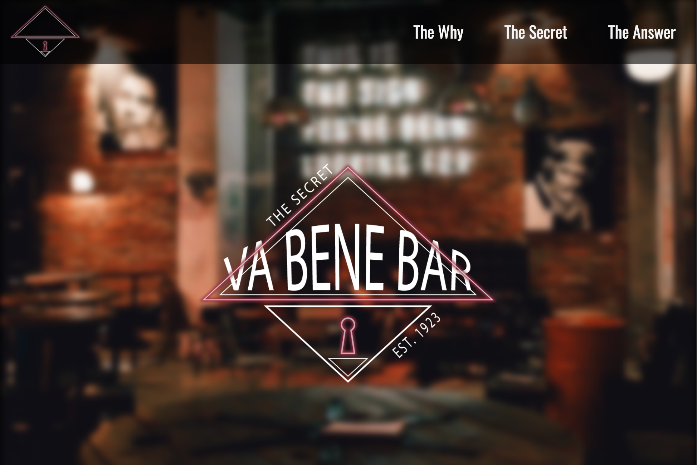
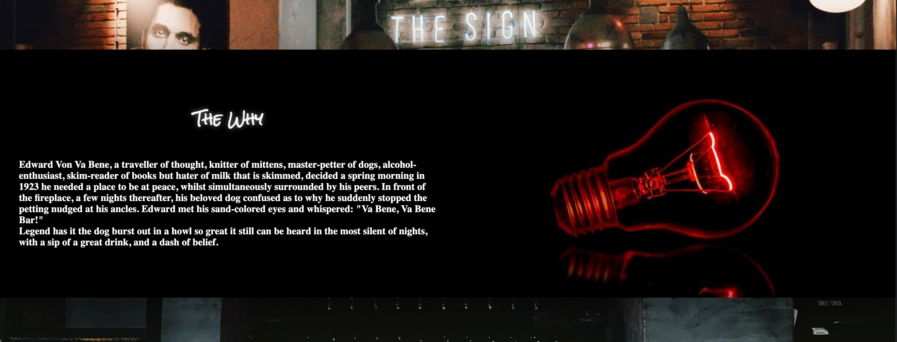
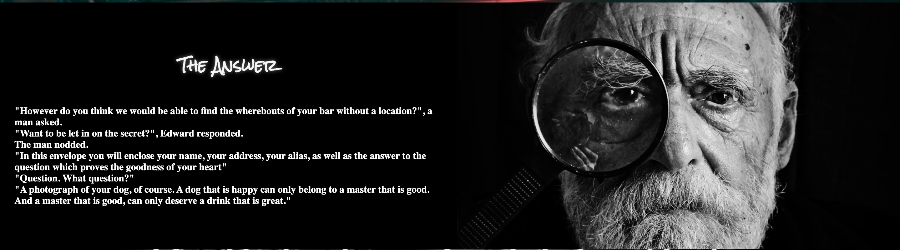
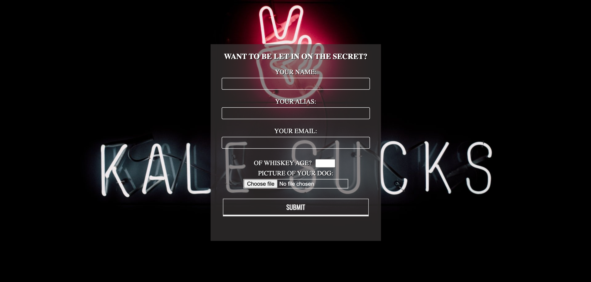

# Va Bene Bar

The Va Bene Bar is a site that will help the curious, the artistic, the seeker of tiny adventures, to find a bar suitable for them. A secret will always be an attractive aspect to an activity, because of the simple reason that it's fun to talk about it. The site hopes to do just that, attract peoples interest in being one of the few that get to visit it.

## Features

In this section, you should go over the different parts of your project, and describe each in a sentence or so. You will need to explain what value each of the features provides for the user, focusing on who this website is for, what it is that they want to achieve and how your project is the best way to help them achieve these things.

### Existing Features

-   **Navigation Bar**

    -   The full responsive Navbar includes links to three parts of the page. Considering it's a one-page website they needed to be equally devided in thirds.
    -   One part defines a part of the websites story (The Why, The Secret, The Answer)

-   **The landing page image**

    -   A big centered logo in front of a background that sets the mood of the rest of the website.
    -   The Parallax-effect instantly sets the need for scrolling to stay on the site.

-   **The Why section**

    -   The Why Section lets the user see the first part of the story
    -   The user will connect the lightbulb with it having something to do with an idea.

-   **The Secret section**

    -   The Secret section lets user be a part of the second part of the story where charming Edward is fed up with his creation, seeking other ideas.
    -   In the story four drinks are mentioned, which are also shown underneath in a display with blurred out ingredients (to play on the secrecy)

-   **The Answer section**

    -   The final part of the story. Edward lets the user know what is required to get the location of the secret bar.
    -   The ending image reveals the face of Edward for the user.

    

    **The Form section**

    -
    -

    

-   **The Footer**

### Existing Features

**UX**

### Features Left to Implement

-   Another feature idea

## Testing

### Validator Testing

-   HTML
    -   No errors were returned when passing through the official [W3C validator](https://validator.w3.org/nu/?doc=https%3A%2F%2Fcode-institute-org.github.io%2Flove-running-2.0%2Findex.html)
-   CSS
    -   No errors were found when passing through the official [(Jigsaw) validator](https://jigsaw.w3.org/css-validator/validator?uri=https%3A%2F%2Fvalidator.w3.org%2Fnu%2F%3Fdoc%3Dhttps%253A%252F%252Fcode-institute-org.github.io%252Flove-running-2.0%252Findex.html&profile=css3svg&usermedium=all&warning=1&vextwarning=&lang=en#css)

### Unfixed Bugs

You will need to mention unfixed bugs and why they were not fixed. This section should include shortcomings of the frameworks or technologies used. Although time can be a big variable to consider, paucity of time and difficulty understanding implementation is not a valid reason to leave bugs unfixed.

## Deployment

This section should describe the process you went through to deploy the project to a hosting platform (e.g. GitHub)

-   The site was deployed to GitHub pages. The steps to deploy are as follows:
    -   In the GitHub repository, navigate to the Settings tab
    -   From the source section drop-down menu, select the Master Branch
    -   Once the master branch has been selected, the page will be automatically refreshed with a detailed ribbon display to indicate the successful deployment.

The live link can be found here - https://code-institute-org.github.io/love-running-2.0/index.html

## Credits

### Content

-   The text for the Home page was taken from Wikipedia Article A
-   Instructions on how to implement form validation on the Sign Up page was taken from [Specific YouTube Tutorial](https://www.youtube.com/)
-   The icons in the footer were taken from [Font Awesome](https://fontawesome.com/)

### Media

-   The photos used on the home and sign up page are from This Open Source site
-   The images used for the gallery page were taken from this other open source site

Congratulations on completing your Readme, you have made another big stride in the direction of being a developer!

## Other General Project Advice

Below you will find a couple of extra tips that may be helpful when completing your project. Remember that each of these projects will become part of your final portfolio so it’s important to allow enough time to showcase your best work!

-   One of the most basic elements of keeping a healthy commit history is with the commit message. When getting started with your project, read through [this article](https://chris.beams.io/posts/git-commit/) by Chris Beams on How to Write a Git Commit Message

    -   Make sure to keep the messages in the imperative mood

-   When naming the files in your project directory, make sure to consider meaningful naming of files, point to specific names and sections of content.

    -   For example, instead of naming an image used ‘image1.png’ consider naming it ‘landing_page_img.png’. This will ensure that there are clear file paths kept.

-   Do some extra research on good and bad coding practices, there are a handful of useful articles to read, consider reviewing the following list when getting started:
    -   [Writing Your Best Code](https://learn.shayhowe.com/html-css/writing-your-best-code/)
    -   [HTML & CSS Coding Best Practices](https://medium.com/@inceptiondj.info/html-css-coding-best-practice-fadb9870a00f)
    -   [Google HTML/CSS Style Guide](https://google.github.io/styleguide/htmlcssguide.html#General)

Getting started with your Portfolio Projects can be daunting, planning your project can make it a lot easier to tackle, take small steps to reach the final outcome and enjoy the process!
